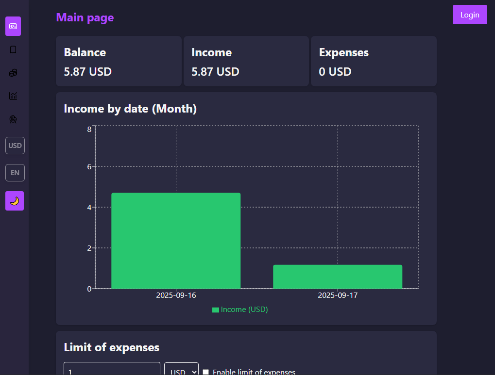
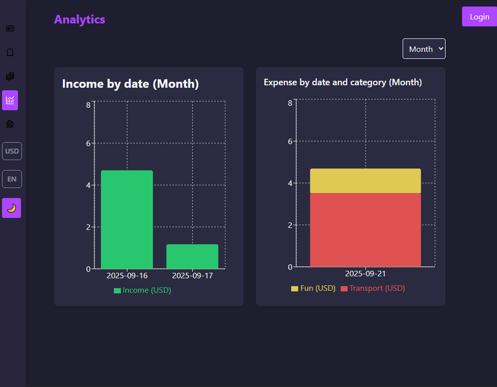

# 💰 Finance Tracker 2.0

**Finance Tracker 2.0** is a **PWA application** for managing personal finances.
It’s built as a fullstack project: **React + TypeScript (frontend)** and **Express + MongoDB (backend)**.
The app supports offline mode, JWT authentication, and provides clean financial analytics with interactive charts.

🔗 **Live Demo**: [View on Vercel](https://finance-tracker-2-0-nu.vercel.app/)
📂 **Backend Repo**: (https://github.com/romanddevcode/finance-backend)

---

## ✨ Features

* 🔐 User authentication & registration (JWT + middleware)
* 📊 Dashboard with income & expense overview
* 💸 Transaction management (create, view, delete)
* 🎯 Financial goals (add, update, track progress)
* 🏦 Budget setting & limit tracking
* 📉 Analytics with interactive charts (Chart.js)
* 📱 Responsive UI (Desktop + Mobile)
* 📡 Data synchronization with backend + offline mode (IndexedDB via Dexie.js)
* 🧩 Minimalistic UI with TailwindCSS
* 🌐 Multi-language support like de, ua, en languages (i18n)

---

## 🛠️ Tech Stack

### Frontend

* [React 18](https://react.dev/) + [TypeScript](https://www.typescriptlang.org/)
* [Vite](https://vitejs.dev/)
* [Zustand](https://zustand-demo.pmnd.rs/) — state management
* [Dexie.js](https://dexie.org/) — offline mode (IndexedDB)
* [TailwindCSS](https://tailwindcss.com/) — styling
* [Chart.js](https://www.chartjs.org/) — charts & analytics
* [react-i18next](https://react.i18next.com/) — multi-language support

### Backend

* [Node.js](https://nodejs.org/) + [Express](https://expressjs.com/)
* [MongoDB](https://www.mongodb.com/)
* [Mongoose](https://mongoosejs.com/)
* JWT authentication with middleware
* REST API for transactions, goals & budget

### Testing

* [Vitest](https://vitest.dev/) + [React Testing Library](https://testing-library.com/)

---

## 📸 Screenshots




## 🚀 Installation & Setup

### Frontend

```bash
git clone https://github.com/romanddevcode/Finance-tracker-2.0.git
cd Finance-tracker-2.0
npm install
npm run dev
```
